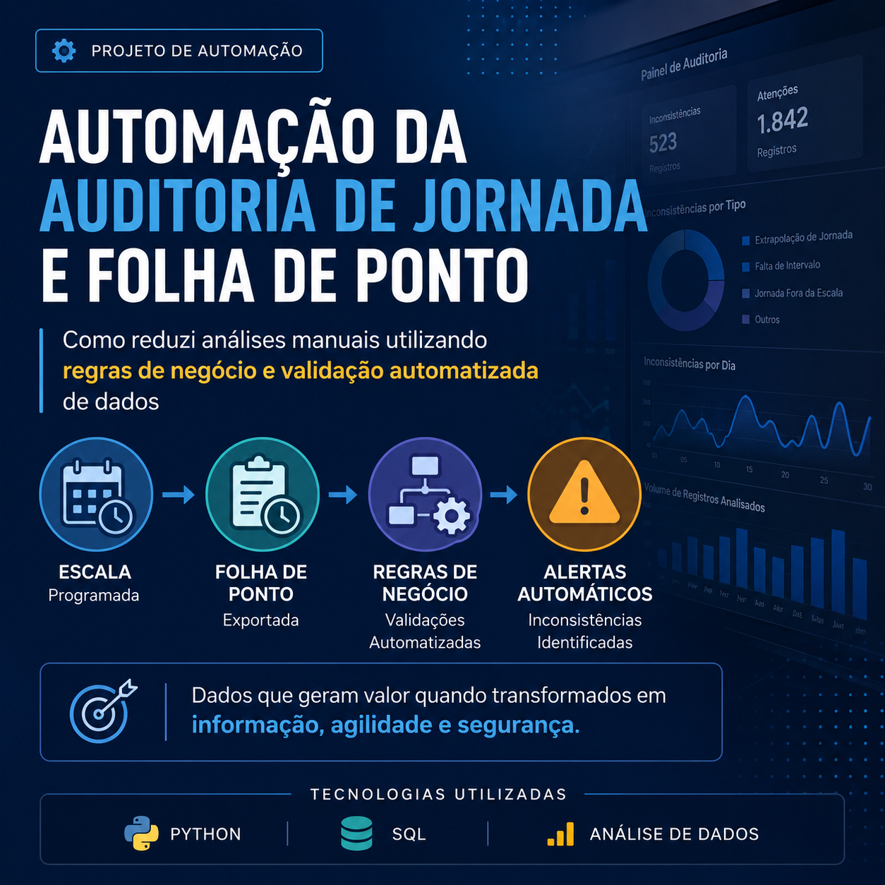
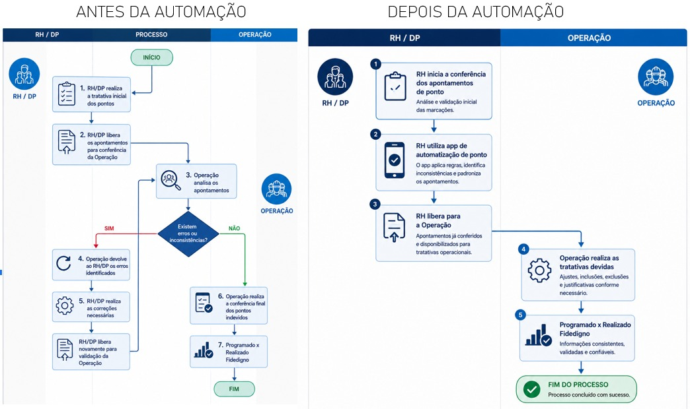
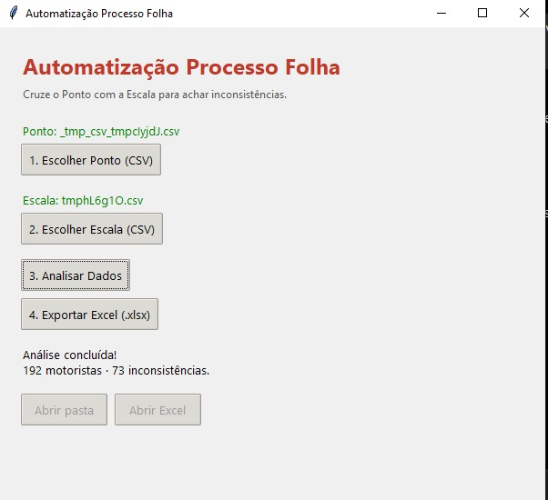

Automação de Conferência de Folha de Ponto

Objetivo:
Automatizar a auditoria entre escala programada e folha de ponto, identificando inconsistências que podem impactar a folha de pagamento.

Problema:
O processo era realizado manualmente e demandava aproximadamente 3 horas de análise.

Solução:
Desenvolvimento de uma aplicação em Python que:
Importa arquivos de escala e folha de ponto
Aplica regras de negócio automaticamente
Identifica inconsistências
Gera relatório para validação

Resultados:
✅ Redução do tempo de análise de 3 horas para aproximadamente 1 minuto
✅ Processamento de grandes volumes de registros
✅ Padronização das validações
✅ Redução do risco de erros de pagamento

Tecnologias Utilizadas
Python
Pandas
OpenPyXL
Tkinter
Excel

Fluxo da Solução:

Tela inicial:

